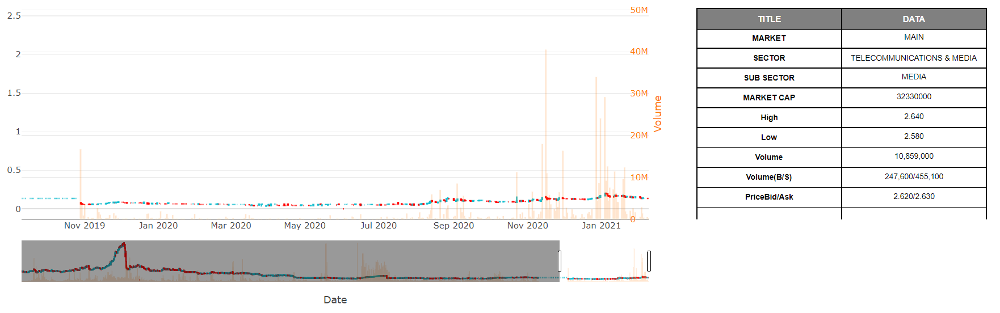

### Plotly Charting

Multiple YAxes Chart

> html

```html
<head>
  ...
  <!-- import plotly package -->
  <script src="https://cdn.plot.ly/plotly-latest.min.js"></script>
</head>
<div id="myDiv"></div>
```

> javascript

```javascript
// 1st chart setup
var trace1 = {
  x: [1, 2, 3], // xaxis data
  y: [40, 50, 60], // yaxis data
  name: "yaxis data",
  type: "scatter", // chart-type
};

// 2nd chart setup
var trace2 = {
  x: [2, 3, 4], // xaxis data
  y: [4, 5, 6], // yaxis data
  name: "yaxis2 data",
  yaxis: "y2",
  type: "scatter", // chart-type
};

var data = [trace1, trace2]; // ploting list

// chart layout
var layout = {
  title: "Double Y Axis Example",
  yaxis: { title: "yaxis title" },
  yaxis2: {
    title: "yaxis2 title",
    titlefont: { color: "rgb(148, 103, 189)" },
    tickfont: { color: "rgb(148, 103, 189)" },
    overlaying: "y",
    side: "right",
  },
};
Plotly.newPlot("myDiv", data, layout); // Plot chart to the <div> based on ID
```

### Stock Chart

Candlestick chart combined with volume bar chart and data table for subplot

> html

```html
<head>
  ...
  <!-- import plotly package -->
  <script src="https://cdn.plot.ly/plotly-latest.min.js"></script>
</head>
<div id="stock-chart"></div>
```

> javascript

```javascript
var stocklist = historicalprice; // Array
var datelist = []; // Date format must be "yyyy-mm-dd"
var closelist = [];
var openlist = [];
var highlist = [];
var lowlist = [];
var volumelist = [];

// Loop array to append all the data to list
for (var i = 0; i <div stocklist.length; i++) {
  datelist.push(stocklist[i].date);
  closelist.push(stocklist[i].close);
  openlist.push(stocklist[i].open);
  highlist.push(stocklist[i].high);
  lowlist.push(stocklist[i].low);
  volumelist.push(stocklist[i].volume);
}

// Chart 1 - Candlestick
var trace1 = {
  x: datelist, // xaxis data = date

  close: closelist, // close price list

  decreasing: { line: { color: "red" } },

  high: highlist, // high price list

  increasing: { line: { color: "#17BECF" } },

  line: { color: "rgba(31,119,180,1)" },

  low: lowlist, // low price list

  open: openlist, // open price list

  type: "candlestick", // chart type - candlestick
  xaxis: "x", // assign x(date) to xaxis
  yaxis: "y",
};

// Chart 2 - Bar Chart (Volume)
var trace2 = {
  x: datelist, // xaxis data = date (must tally with chart 1)
  y: volumelist, // yaxis data = volume list
  name: "yaxis2 data",
  yaxis: "y2", // set the yaxis as second axis
  type: "bar", // chart type
  opacity: 0.4, // set the bar color transparency
};

// Table Chart
var values = [
  ["Salaries", "Office", "Merchandise", "Legal", "<b>TOTAL</b>"],
  [1200000, 20000, 80000, 2000, 12120000],
  [1300000, 20000, 70000, 2000, 130902000],
  [1300000, 20000, 120000, 2000, 131222000],
  [1400000, 20000, 90000, 2000, 14102000],
];

var table = {
  type: "table", // type must be table
  header: {
    // header list (<b></b> affect the string to bold)
    values: [["<b>EXPENSES</b>"], ["<b>Q1</b>"], ["<b>Q2</b>"], ["<b>Q3</b>"], ["<b>Q4</b>"]],
    align: "center",
    line: { width: 1, color: "black" },
    fill: { color: "grey" },
    font: { family: "Arial", size: 12, color: "white" },
  },
  cells: {
    // Table arrangment
    // [header, header, header] <-header->
    // [   1  ,   2   ,   3] <-cell array[0]->
    // [   2  ,   3   ,   4] <-cell array[1]->
    values: values,
    align: "center",
    line: { color: "black", width: 1 },
    font: { family: "Arial", size: 11, color: ["black"] },
  },
  xaxis: "x3", // set as third xaxis
  yaxis: "y3", // set as third yaxis
  domain: { x: [0.7, 1], y: [0, 1] },
};

// layout
var layout = {
  // <--- grid: {rows: 1, columns: 2, pattern: 'independent'}, ---> // grid layout
  // <--- dragmode: 'zoom', ---> // don't know what is this
  margin: {
    r: 10,
    t: 25,
    b: 40,
    l: 60,
  },
  showlegend: false,
  xaxis: {
    // <--- autorange: true, ---> // if autorange set to true, slider range can't be set range
    domain: [0, 0.65], // set axis from min:0 to max:1
    range: [datelist[datelist.length - 350], datelist[datelist.length - 1]], // set the slider default range
    title: "Date",
    type: "date",
  },
  yaxis: {
    autorange: true,
    domain: [0, 1],
    // <--- range: [114.609999778, 137.410004222], ---> // Set range for yaxis
    type: "linear",
  },
  yaxis2: {
    title: "Volume",
    autorange: true,
    domain: [0, 1], // set axis from min:0 to max:1
    titlefont: { color: "#ff7f0e" },
    tickfont: { color: "#ff7f0e" },
    // <--- anchor: 'free', ---> // don't know what usage
    overlaying: "y",
    side: "right", // set the direction for second chart(volume) yaxis
    position: 0.63, // position (need to depend on chart 1 domain[0, 0.63])
  },
};

var data = [trace1, trace2, table]; // ploting chart list
Plotly.newPlot("stock-chart", data, layout); // plot chart on <div id="stock-chart></div>
```

output :

